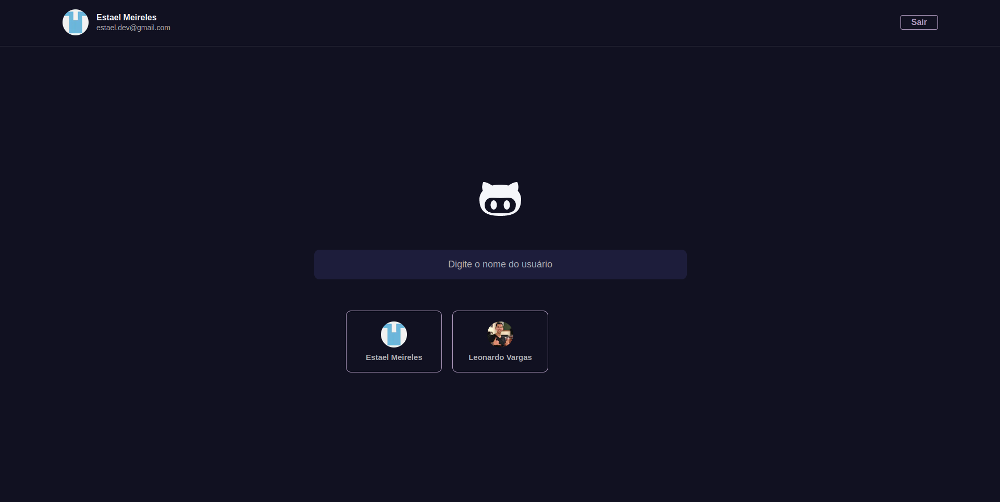

<h1 align='center'>
    Github-Explorer
</h1>



## Projeto

Esse projeto é uma ferramento integrada com a api do github, podendo buscar um perfil e ver os repositórios do perfil buscado.

## Funcionalidades

- [X] Autenticação com `nextAuth`.
- [X] Rotas dinâmicas com o `next params`.
- [X] Salvando perfis no `localStorage`.

## Como executar 

Será necessário fazer o clone do projeto

```bash
$ git clone https://github.com/estaeldev/github-explorer
```

Instalar as dependências e executar o script de inicialização

```bash
$ yarn

$ yarn next
```

